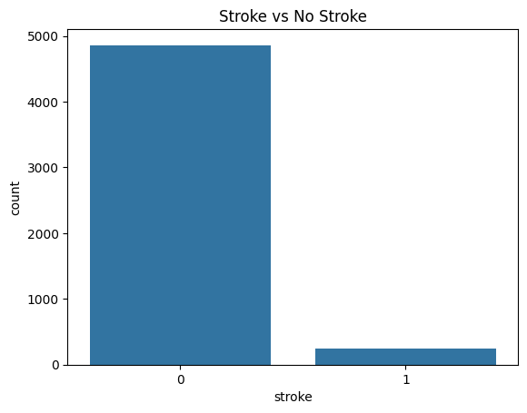
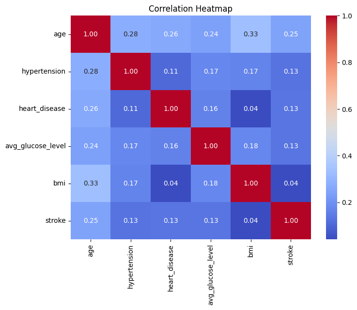
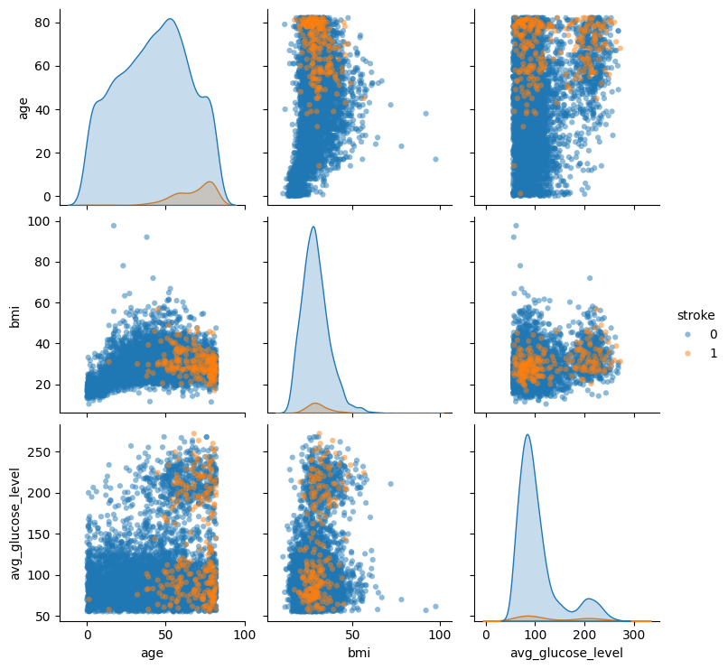
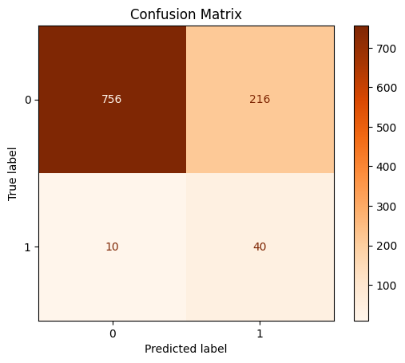
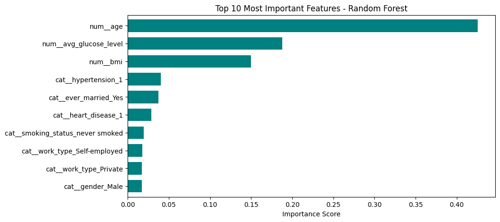
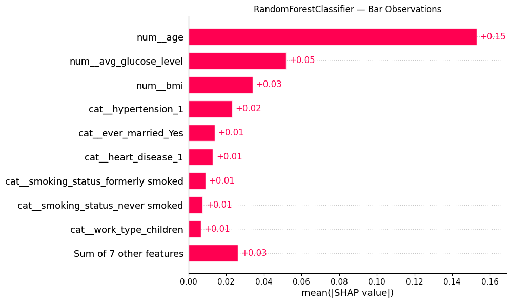
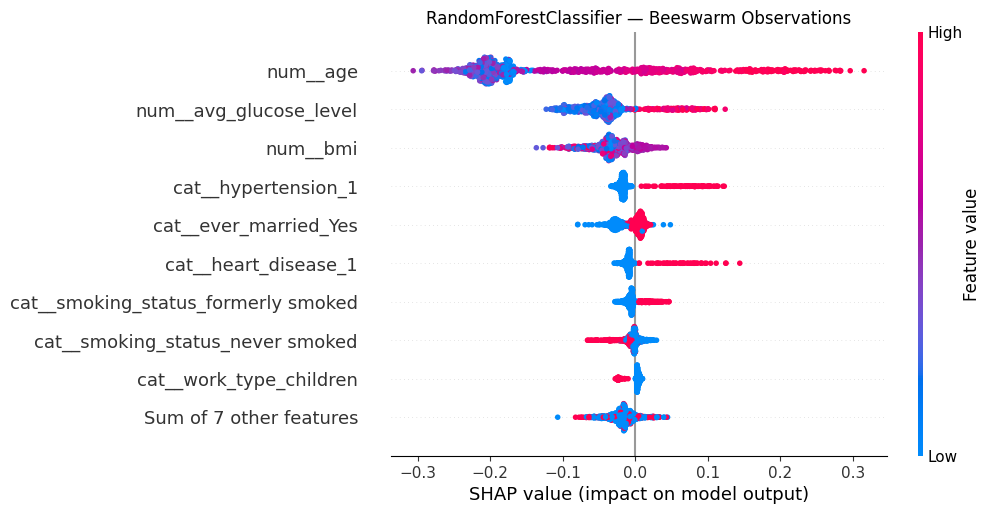

# stroke_factors_analysis
Cohort8 - DS3

#### Goal: Determine top 3 factors - lifestyle or health -  for stroke prediction. 

## Purpose and Overview: Introduce the project with essential details, concise description and a project objective.

Data source: Stroke Prediction Dataset from Kaggle (https://www.kaggle.com/datasets/fedesoriano/stroke-prediction-dataset)

 The goal of this project is to transform the stroke prediction dataset into an actionable priority list. Determining a certain factor significantly more predictive than other factors allows an individual, healthcare provider, or business to develop interventions more effectively, reduce preventable hospitalizations, and improve long-term health outcomes rather than relying on reactive interventions.

## Project Scope 
By identifying the top three predictors of a stroke using the Stroke Prediction Dataset, we aim to shift the focus from reactive treatment to targeted preventative medicine and to support strategic planning for stakeholders. 

### Stakeholders 
Hospital administrators, clinicians, and allied health professionals: Identify high‑risk populations, develop screening protocols to flag high-risk patients, improve triage protocols for patients to improve care pathways, and support quality improvement initiatives to reduce readmissions. 

Public Health Organizations, Epidemiologists, and Biostaticians: This includes organizations such as World Health Organization (WHO), Centers of Disease Control and Prevention (CDC), and regional health units. Provide population-level analysis to identify trends and patterns among different populations. Develop campaigns, patient education materials based on common risk factors, and coordinate community outreach for high-risk populations to implement population-level prevention. 

Legislative bodies: Aid in long-term planning and resource allocation to health care organizations. Can help with policy development around chronic disease management, screening recommendations, and stroke prevention strategies. 

Health equity and community health organizations: Help reduce disparities among high-risk populations, improve access to care, and address social determinants of health that contribute to stroke risk. They can also help with alleviating stress on hospitals by providing community based care to reduce readmissions and improve chronic disease management.

## Methodology
### Steps taken:
- Data Cleaning 
- Data Exploration and Visualization 
- Logistic Regression Analysis
- Classification Modelling 

### Technical Stack:

#### Programming Language:
Python
#### Libraries Used:
- Numpy: matrix operations
- Pandas: data analysis
- Matplotlib: creating graphs and plots
- Seaborn: enhancing matplotlib plots
- SKLearn: regression analysis

## Data Cleaning 
Objective: check for missing values, categorical variables for transformation, and summarize general statistics for the dataset

Method:
- info() was used to see all the features and check for missing values 
- value_counts() was used to count the frequency of unique values for each feature
- describe() was used to produce a general statistics table for numerical variable 

Results: 
- Missing values for BMI and Unknown values for Smoking Status
- Five categorical variables: ["gender", "ever_married", "work_type", "Residence_type", "smoking_status"]
- Summary statistics shown below:

<table border="1" class="dataframe">
  <thead>
    <tr style="text-align: right;">
      <th></th>
      <th>id</th>
      <th>age</th>
      <th>hypertension</th>
      <th>heart_disease</th>
      <th>avg_glucose_level</th>
      <th>bmi</th>
      <th>stroke</th>
    </tr>
  </thead>
  <tbody>
    <tr>
      <th>count</th>
      <td>5110.000000</td>
      <td>5110.000000</td>
      <td>5110.000000</td>
      <td>5110.000000</td>
      <td>5110.000000</td>
      <td>4909.000000</td>
      <td>5110.000000</td>
    </tr>
    <tr>
      <th>mean</th>
      <td>36517.829354</td>
      <td>43.226614</td>
      <td>0.097456</td>
      <td>0.054012</td>
      <td>106.147677</td>
      <td>28.893237</td>
      <td>0.048728</td>
    </tr>
    <tr>
      <th>std</th>
      <td>21161.721625</td>
      <td>22.612647</td>
      <td>0.296607</td>
      <td>0.226063</td>
      <td>45.283560</td>
      <td>7.854067</td>
      <td>0.215320</td>
    </tr>
    <tr>
      <th>min</th>
      <td>67.000000</td>
      <td>0.080000</td>
      <td>0.000000</td>
      <td>0.000000</td>
      <td>55.120000</td>
      <td>10.300000</td>
      <td>0.000000</td>
    </tr>
    <tr>
      <th>25%</th>
      <td>17741.250000</td>
      <td>25.000000</td>
      <td>0.000000</td>
      <td>0.000000</td>
      <td>77.245000</td>
      <td>23.500000</td>
      <td>0.000000</td>
    </tr>
    <tr>
      <th>50%</th>
      <td>36932.000000</td>
      <td>45.000000</td>
      <td>0.000000</td>
      <td>0.000000</td>
      <td>91.885000</td>
      <td>28.100000</td>
      <td>0.000000</td>
    </tr>
    <tr>
      <th>75%</th>
      <td>54682.000000</td>
      <td>61.000000</td>
      <td>0.000000</td>
      <td>0.000000</td>
      <td>114.090000</td>
      <td>33.100000</td>
      <td>0.000000</td>
    </tr>
    <tr>
      <th>max</th>
      <td>72940.000000</td>
      <td>82.000000</td>
      <td>1.000000</td>
      <td>1.000000</td>
      <td>271.740000</td>
      <td>97.600000</td>
      <td>1.000000</td>
    </tr>
  </tbody>
</table>

## Exploratory Analysis
Objective: understand and visualize the data, explore correlations <add>

Method: 
- pairplot
- visualize correlation matrix with heatmap 
- countplot
- histplot
- violinplot
- boxplot 

- Visualizing stroke count 

- Using heat map to understand feature correlation

- Using pairplot to understand the correlation between age, bmi, avg glucose level and stroke

Results:

## Regression and Classification Modelling  

Our project aims to identify the top three factors contributing to stroke occurrence among patients, represented by the variable stroke. Exploratory Data Analysis (EDA) suggests that age, average glucose level, and BMI are the most influential factors associated with stroke risk.

To further validate these insights, we experimented with three classification models: Random Forest, XGBoost, and Logistic Regression.

Random Forest was selected because it is simple to implement, easy to interpret, robust against overfitting, and relatively straightforward to tune. XGBoost was also considered because it typically provides higher predictive accuracy, faster performance through optimization techniques, and effective handling of missing values. Logistic Regression was included as well since it is well-suited for binary classification problems and offers strong interpretability.

A more detailed analysis of these models and their performance can be found in the accompanying file [model README](./notebooks/README.md)

- Encode the categorical variable (BMI) using an appropriate encoder.
- Split the dataset into training and testing sets.
- Train the models using the training dataset.
- Generate predictions on the test dataset.
- Evaluate model performance using the PR-AUC metric at a specified recall value of 0.8, and determine the optimal classification threshold.

- Extract feature importance from the model and plot it as a barplot in order of importance to the stroke prediction.

## Summary of Classification Modeling

Three models were developed to predict stroke risk in patients: Logistic Regression, Random Forest, and XGBoost. Across all models, age was identified as the most important predictor of stroke.

For the Random Forest model, the top three features are age, average glucose level, and BMI.
For XGBoost, the most important features are age, gender, and hypertension.
For Logistic Regression, the key predictors are age, work type (children), and smoking status (smokers). The consistent ranking of age as the top factor across all models highlights its strong association with stroke risk.

To interpret the model predictions, SHAP (SHapley Additive exPlanations) was used for all three models. SHAP analysis helps explain how individual features contribute to the prediction results.

The SHAP bar and beeswarm plots show that age, average glucose level, and BMI are the most influential features for both Random Forest and XGBoost, indicating strong agreement between the two models. For Logistic Regression, the top SHAP features are age, work type (children), and work type (self-employed).

Overall, greater confidence is placed in the Random Forest and XGBoost models because the dataset is highly imbalanced (about 5% stroke cases), and tree-based models generally perform better than Logistic Regression on imbalanced datasets. SHAP explanations also highlight which features increase or decrease the predicted stroke risk for individual patients.

Different machine learning models, Random Forest, XGBoost, and Logistic Regression, produced varying feature importance rankings because each model captures relationships in the data differently. Therefore, clinical domain knowledge from medical experts should be considered when interpreting these results to ensure that the identified important features are consistent with medical understanding, clinically meaningful, and aligned with  knowledge about stroke risk factors.

## Conclusions and Discussions and Limitations 

In conclusion, our analysis identified older age, BMI, and blood glucose levels as the three primary risk factors for stroke. These factors do not exist independently; they influence one another and are strongly connected to long-term lifestyle habits. Since stroke risk develops gradually over time, effective prevention requires long-term behavioral changes rather than quick solutions.

To address this, we propose a habit-forming prevention program focused on individuals who are approaching higher stroke risk, including adults starting around age 30, rather than only targeting people already in high-risk age groups. The program would begin with short-term tracking of daily meals and lifestyle patterns to better understand participants’ routines and constraints. From there, it would encourage gradual improvements in diet, physical activity, and overall health habits, making the changes manageable and sustainable. Progress would be monitored through metrics such as weight, BMI, blood glucose levels, sleep, and stress, with incentives built in to encourage continued participation.

Implementation could rely on existing digital health infrastructure, such as wearable fitness devices and mobile health apps, which make it easy for participants to track behaviors and for program organizers to monitor progress. These tools would help provide feedback and maintain engagement while minimizing inconvenience for users.

In addition, digital health tools and community-based programs could help reach populations that may not regularly interact with the healthcare system, including younger individuals, people without a primary care physician, or those affected by social determinants of health. Apps that assess stroke risk and community initiatives like nutrition classes, fitness programs, and culturally tailored workshops could provide accessible ways to promote healthier habits.

Overall, the program focuses on incremental lifestyle changes, continuous monitoring, and supportive incentives to build sustainable habits that reduce stroke risk over time while promoting equitable access to prevention strategies.

One limitation of this dataset is that it provides only a snapshot in time of each individual rather than tracking health changes over time. Because it is cross-sectional, we cannot determine how long someone has had risk factors such as a high BMI or elevated blood glucose levels. This makes it difficult to understand whether stroke risk is influenced by short-term measurements or long-term exposure to these conditions, since health outcomes often develop gradually over many years.

Another limitation involves the dataset’s strongest predictors of stroke—age, BMI, and blood glucose—which include both modifiable and non-modifiable factors. Age will always increase and cannot be changed, while BMI and glucose levels can fluctuate depending on lifestyle, environment, and access to healthcare. Since the data captures only one moment in time, it is difficult to determine whether stroke risk is driven mainly by aging, by long-term lifestyle factors, or by the interaction between the two.

Finally, the dataset comes from global World Health Organization data, meaning it intentionally excludes details such as socioeconomic status, genetics, and regional environmental differences. As a result, any conclusions drawn from the analysis must remain generalized and may not fully apply to specific populations or local contexts, where these additional factors could significantly influence stroke risk.

Ideas for Future Analyses: 

One possible future analysis would be to further explore interactions between the key predictors identified in our study. While our analysis identified these as the strongest individual predictors of stroke, additional work could examine how combinations of these variables influence risk, such as whether individuals with both high BMI and high glucose levels experience a disproportionately higher stroke risk compared to those with only one elevated factor.

Another direction would be to perform subgroup analyses across age categories and threshold effects within the dataset. For example, researchers could examine whether BMI or blood glucose plays a stronger role in predicting stroke within different age groups. This could help determine whether certain risk factors become more influential as people age.
Future analyses could examine specific cutoff points to identify levels at which stroke risk begins to increase significantly.

These analyses would help deepen the understanding of stroke risk patterns using the same dataset while providing more detailed insights into how key variables interact and influence outcomes.

## Team Videos 

- Aravind: https://streamable.com/rjpu9g
- [Karen Huang](https://drive.google.com/file/d/16vHZsve5boisCHrsl_glS09IfZ0HdWHR/view?usp=sharing)

## References 
1. GBD 2021 Stroke Risk Factor Collaborators. Global, regional, and national burden of stroke and its risk factors, 1990–2021: a systematic analysis for the Global Burden of Disease Study 2021. The Lancet Neurology. 18 September 2024. doi: 10.1016/S1474-4422(24)00369-7.
2. Strilciuc S, et.al. The economic burden of stroke: a systematic review of cost of illness studies. J Med Life. 2021 Sep-Oct;14(5):606–619. doi: 10.25122/jml-2021-0361.
3. Hankey GJ. Stroke: how large a public health problem, and how can the neurologist help? Arch Neurol. 1999 Jun;56(6):748-54. doi: 10.1001/archneur.56.6.748. PMID: 10369318.
4. Rajabpour M, et. al. Perceived need to prevent stroke readmission: A qualitative study from the perspective of stroke patients and healthcare professionals. J Educ Health Promot. 2025 Aug 29;14:335. doi: 10.4103/jehp.jehp_854_24. PMID: 40979314; PMCID: PMC12448509.
5. Elamy, A. H., Shuaib, A., Carriere, K. C., & Jeerakathil, T. (2020). Common Comorbidities of Stroke in the Canadian Population. The Canadian journal of neurological sciences. Le journal canadien des sciences neurologiques, 47(3), 314–319. https://doi.org/10.1017/cjn.2020.17
6. Vyas, M. V., Fang, J., de Oliveira, C., Austin, P. C., Yu, A. Y. X., & Kapral, M. K. (2023). Attributable Costs of Stroke in Ontario, Canada and Their Variation by Stroke Type and Social Determinants of Health. Stroke, 54(11), 2824–2831. https://doi.org/10.1161/STROKEAHA.123.043369
7. “Stroke.” Johns Hopkins Medicine, https://www.hopkinsmedicine.org/health/conditions-and-diseases/stroke. Accessed 26 February 2026.

### Week1 Expectations 

1. The business motivation for your project.

We have chosen our project as “The top 3 predictors of having a stroke – is it lifestyle-based or health-based?"
Our motivation isn't just about "finding numbers"—it’s about proactive healthcare management through appropriate / applicable lifestyle changes. The goal of this analysis is to transform a complex dataset into an actionable priority list. Determining a certain factor significantly more predictive than other factors allows an individual, healthcare provider, or business to develop interventions more effectively, reduce preventable hospitalizations, and improve long-term health outcomes rather than relying on reactive interventions.

The Problem:

Stroke is the 3rd leading cause of disability and mortality worldwide with an estimated 93.8 million cases(1). Strokes represent a "high-cost, high-impact" event for hospitals and insurance companies(2). Stroke can be a comorbidity risk factor to other health conditions resulting in a high demand for support for patients and strain on the health care system(5). The mean of 1-year attributable costs for stroke patients in Canada ranged from $33 231-$33 8136. The cost also varied among different population groups, where immigrants and low-income households had higher costs (6). Although reactive treatment is significantly more expensive and less effective than preventive care(3), healthcare stakeholders are often overwhelmed by data, making it difficult to pinpoint which specific lifestyle or physiological factors require the most immediate intervention(4).

Purpose and Overview: 

By identifying the top three predictors of a stroke using the Stroke Prediction Dataset, we aim to shift the focus from reactive treatment to targeted preventative medicine and to support strategic planning for stakeholders. 

Stakeholders: 

Hospital administrators, clinicians, and allied health professionals: Identify high‑risk populations, develop screening protocols to flag high-risk patients, improve triage protocols for patients to improve care pathways, and support quality improvement initiatives to reduce readmissions. 

Public Health Organizations, Epidemiologists, and Biostaticians: This includes organizations such as World Health Organization (WHO), Centers of Disease Control and Prevention (CDC), and regional health units. Provide population-level analysis to identify trends and patterns among different populations. Develop campaigns, patient education materials based on common risk factors, and coordinate community outreach for high-risk populations to implement population-level prevention. 

Legislative bodies: Aid in long-term planning and resource allocation to health care organizations. Can help with policy development around chronic disease management, screening recommendations, and stroke prevention strategies. 

Health equity and community health organizations: Help reduce disparities among high-risk populations, improve access to care, and address social determinants of health that contribute to stroke risk. They can also help with alleviating stress on hospitals by providing community based care to reduce readmissions and improve chronic disease management.

2. Which dataset you have chosen to use.

Our group chose to use the Stroke Prediction Dataset from Kaggle (https://www.kaggle.com/datasets/fedesoriano/stroke-prediction-dataset)

3. Risks or unknowns that you have identified.

- Initial exploratory data analysis revealed that the dataset is highly unbalanced. Only 249 observations (~5%) are positive for stroke. Limited positive cases for both training and test dataset.  
- Region: we do not know the geographical location of the individuals surveyed. Results may not generalize well to populations living in a different geographical location. 
- Social Determinants of Health: Data about ethnicity, education level, income levels are not available. These demographic and socioeconomic variables are known to influence stroke risk and health outcomes, and their absence represents a key limitation. Results may not generalize well to a different demographic and socioeconomic group. 
- Missing important medical factors such as cholesterol level and diabetes status (7).  
- Missing data for Body Mass Index for some individuals/observations: Requires imputation to determine the statistical significance and to determine if the variable correlates with other variables. 

4. How you will approach the analysis.

- Data exploration with visualizations 
- Data cleaning which includes imputation for missing values 
- Data Modelling
    - Multivariable analysis 
    - Apply logistic regression as baseline model 
    - Apply random forest classification 
    - Compare the classification methods based on accuracy 
    - Determine feature importance
    - Rank each feature
- Identity the top three features that provides the best prediction of stroke outcome 
- Data visualization to show modelling results 
- Recommend lifestyle changes based on top three features to individuals/healthcare provider/health organizations to reduce the prevalence of stroke cases

5. Breakdown of roles/tasks assigned to each team member.

Exploratory data analysis - Aravind Vijayaragavan, Adnan Takash, Naveen Kumar Nair

Data Cleaning - Aravind Vijayaragavan

Data Modeling & Visualization - Adnan Takash, Azadeh Selahvarzi

README documentation, repo structure, code review  - Karen Huang, Yuli Zhang, Naveen Kumar Nair

# References: 

1. GBD 2021 Stroke Risk Factor Collaborators. Global, regional, and national burden of stroke and its risk factors, 1990–2021: a systematic analysis for the Global Burden of Disease Study 2021. The Lancet Neurology. 18 September 2024. doi: 10.1016/S1474-4422(24)00369-7.
2. Strilciuc S, et.al. The economic burden of stroke: a systematic review of cost of illness studies. J Med Life. 2021 Sep-Oct;14(5):606–619. doi: 10.25122/jml-2021-0361.
3. Hankey GJ. Stroke: how large a public health problem, and how can the neurologist help? Arch Neurol. 1999 Jun;56(6):748-54. doi: 10.1001/archneur.56.6.748. PMID: 10369318.
4. Rajabpour M, et. al. Perceived need to prevent stroke readmission: A qualitative study from the perspective of stroke patients and healthcare professionals. J Educ Health Promot. 2025 Aug 29;14:335. doi: 10.4103/jehp.jehp_854_24. PMID: 40979314; PMCID: PMC12448509.
5. Elamy, A. H., Shuaib, A., Carriere, K. C., & Jeerakathil, T. (2020). Common Comorbidities of Stroke in the Canadian Population. The Canadian journal of neurological sciences. Le journal canadien des sciences neurologiques, 47(3), 314–319. https://doi.org/10.1017/cjn.2020.17
6. Vyas, M. V., Fang, J., de Oliveira, C., Austin, P. C., Yu, A. Y. X., & Kapral, M. K. (2023). Attributable Costs of Stroke in Ontario, Canada and Their Variation by Stroke Type and Social Determinants of Health. Stroke, 54(11), 2824–2831. https://doi.org/10.1161/STROKEAHA.123.043369
7. “Stroke.” Johns Hopkins Medicine, https://www.hopkinsmedicine.org/health/conditions-and-diseases/stroke. Accessed 26 February 2026.

